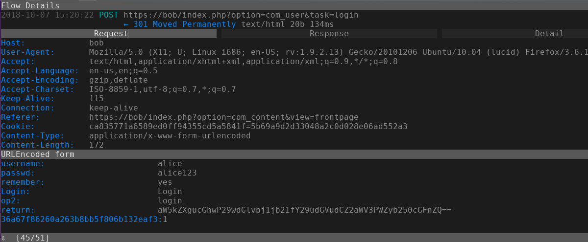

# MiniProject I: Internet Security Protocols

### Assignment 1: Secure Communication

#### Part A

Using Apache HttpClient we have implemented a client and a server.
The client takes 3 parameters:
  1. host
  2. port
  3. message

The server is listening on port 7007 and handling every request with the same handler. Basically it logs the request (time, uri, parameters), and returns the first parameter to the client as a response.

To make the communication secure and ensure integrity we set up a keystore with a self signed certificate. We generated the cert with the following command: `keytool -genkey -keyalg RSA -alias miniproject -keystore selfsigned.jks -keysize 2048` It creates a `.jks` file with the cert. We import this to the software and create an `SSLContext` with it. After injecting the `SSLContext` to the `HTTPServer` we made the communication secure.

The client now is unable to communicate with the server unless it has the same certification. So we inject the same keystore to the client as well.

### Assignment 2: Man-in-the-Middle

#### Part A

We followed the steps: logged in from alice to bob via telnet, while mallory was sniffing with Wireshark.

We found out that TELNET protocol is insecure since we could see the whole communication when we filtered the data exchanged between bob and alice on the `eth0` network to `telnet`. After analyzing the packets we could see the outputs with the login and password. When alice was typing in bobs credentials we first saw the login and password keywords, and after that we saw login/password letter-by-letter. This way mallory is able to login to bob anytime, bob is compromised, the man in the middle was successful.

#### Part B

Following the steps we could sniff the packages but since the communication was using `https` protocol, the messages were encoded, and we could not see the contents. The man-in-the-middle attack was unsuccessful this time.

#### Part C

To set up the proxy on alice's computer we used the GUI which is in `System>Preferences>Network proxy`.

After setting it up correctly we could proxy the messages to mallory's computer, where we used mitmproxy to fake the https credentials and this way we could read the https messages in the mitmproxy UI. For alice this seemed secure, because after sniffing the requests we forwarded them to bob, so alice could use the website.

In mitmproxy we were looking for a `POST` method to the `/login` endpoint, where in the request body we found the `username` and `passwd` fields and the corresponding values.

  

The man-in-the-middle attack was carried out and the attacker got the credentials. All in all mallory could use alice's credentials to buy theself the hammer they wanted.

Additionally, we played around a little and found that bob's password is bob123
